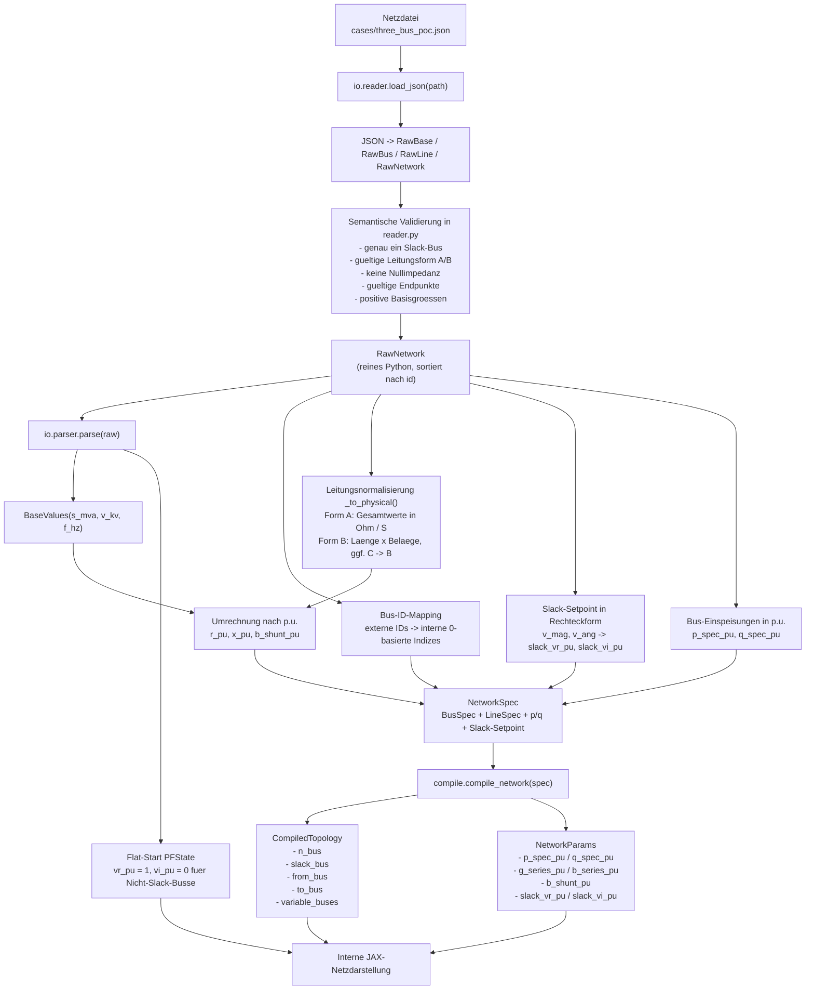
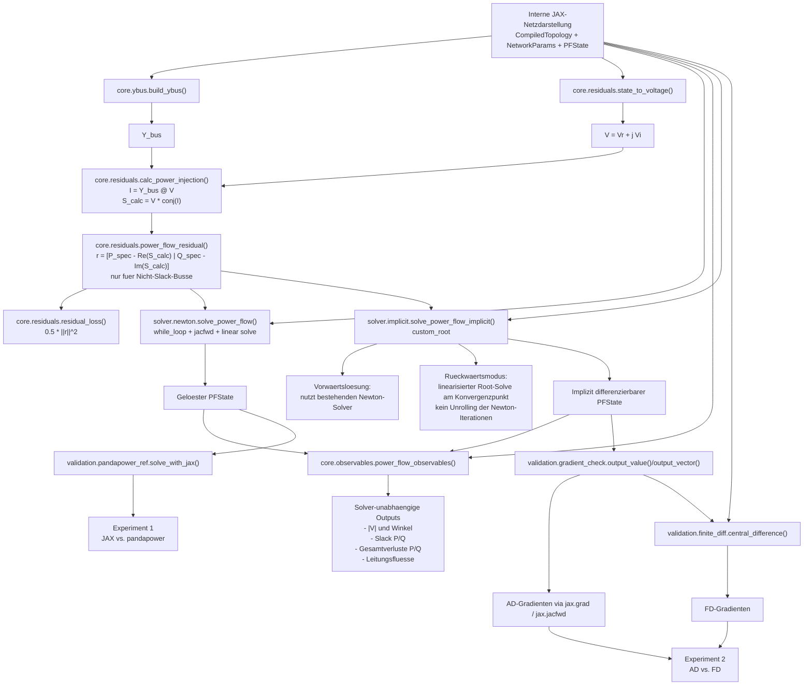

# Datenfluss-Visualisierung

Dieses Dokument visualisiert den aktuellen Datenfluss in `diffpf` in zwei
Schritten:

1. Einlesen und Konvertieren des Eingabenetzes in die interne JAX-Netzdarstellung
2. Datenfluss von der internen JAX-Netzdarstellung durch numerischen Kern,
   Solver und implizite Differenzierung

Die Darstellung orientiert sich an der aktuell implementierten Struktur in
`io/`, `compile/`, `core/`, `solver/` sowie an den bereits vorhandenen
Experimenten 1 und 2.

## 1. Eingabenetz -> interne Netzdarstellung

### Kurzinterpretation

- `reader.py` ist die reine Python-Eingabeschicht. Dort wird nichts in JAX
  gebaut.
- `parser.py` ist die Bruecke zwischen Rohdaten und JAX-Welt.
- Die entscheidende Trennung ist:
  - `CompiledTopology` = statische Struktur
  - `NetworkParams` = differenzierbare physikalische Parameter
  - `PFState` = differenzierbarer Solverzustand
- `compile_network()` ist der letzte Schritt vor dem numerischen Kern. Danach
  arbeitet der Grid-Core nur noch mit Arrays.

## 2. Interne JAX-Netzdarstellung -> Kern -> Solver -> implizite Differenzierung

### Kurzinterpretation

- Der numerische Kern lebt in `core/`:
  - `build_ybus()`
  - `state_to_voltage()`
  - `calc_power_injection()`
  - `power_flow_residual()`
  - `residual_loss()`
- `solver/newton.py` loest das stationaere Root-Problem vorwaerts.
- `solver/implicit.py` verwendet dieselbe Residuenformulierung, aber ersetzt
  die Gradientenableitung durch `jax.lax.custom_root`.
- `core/observables.py` trennt die fachliche Auswertung bewusst vom Solver:
  dieselben Outputs koennen aus Newton- oder implicit-Loesungen berechnet werden.
- Experiment 1 nutzt die Vorwaertsloesung und vergleicht sie mit `pandapower`.
- Experiment 2 nutzt die implizite Loesung plus Observables und vergleicht
  lokale Sensitivitaeten gegen zentrale Finite Differences.

## Einordnung der beiden Experimente

### Experiment 1

Pfad:

`JSON -> RawNetwork -> parse() -> CompiledTopology / NetworkParams / PFState -> solve_power_flow() -> observables / line flows -> Vergleich mit pandapower`

Ziel:

- Validierung des stationaeren Vorwaertssolvers
- Vergleich von Spannungen, Winkeln, Verlusten und Leitungsfluessen

### Experiment 2

Pfad:

`JSON -> RawNetwork -> Szenarioanpassung (low_pv, medium_pv, high_pv) -> parse() -> solve_power_flow_implicit() -> power_flow_observables() -> jax.grad / jacfwd`

Parallel dazu:

`dieselben Outputs -> zentrale Finite Differences`

Ziel:

- Validierung lokaler Sensitivitaeten des differentiierbaren Solvers
- Vergleich von AD-Gradienten und FD-Gradienten fuer ausgewaehlte Inputs und Outputs

## Wichtigste Architekturentscheidung im Gesamtfluss

Die zentrale Softwareidee ist die strikte Trennung von drei Ebenen:

1. Menschenfreundliche Eingabeebene
   `RawNetwork`, JSON, physikalische Einheiten, Leitungsformen A/B

2. Interne JAX-Netzdarstellung
   `CompiledTopology`, `NetworkParams`, `PFState`

3. Numerisch-differenzierbare Kernlogik
   Residuen, Newton-Solver, implizite Differenzierung, Observables

Dadurch koennen spaetere Upstream-Modelle wie PV-Physik oder ein neuronales
PV-Modell denselben Grid-Core verwenden, ohne dass der numerische Kern selbst
umgebaut werden muss.
